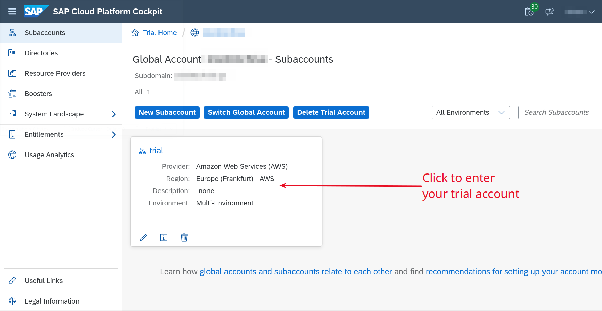
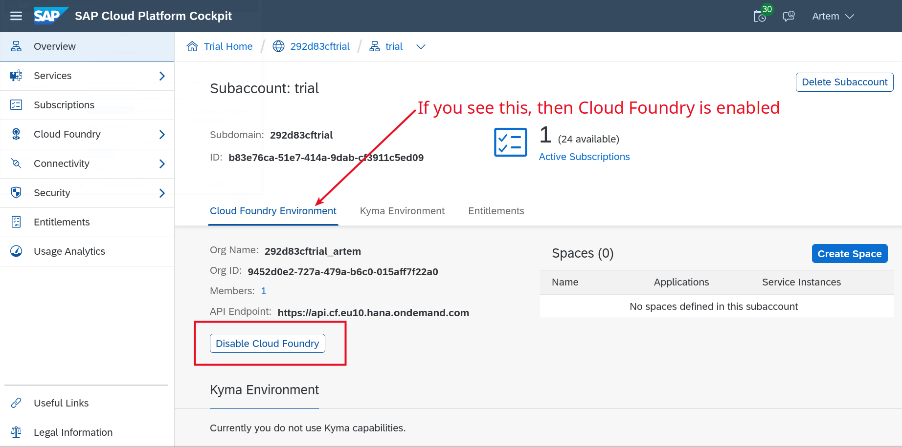
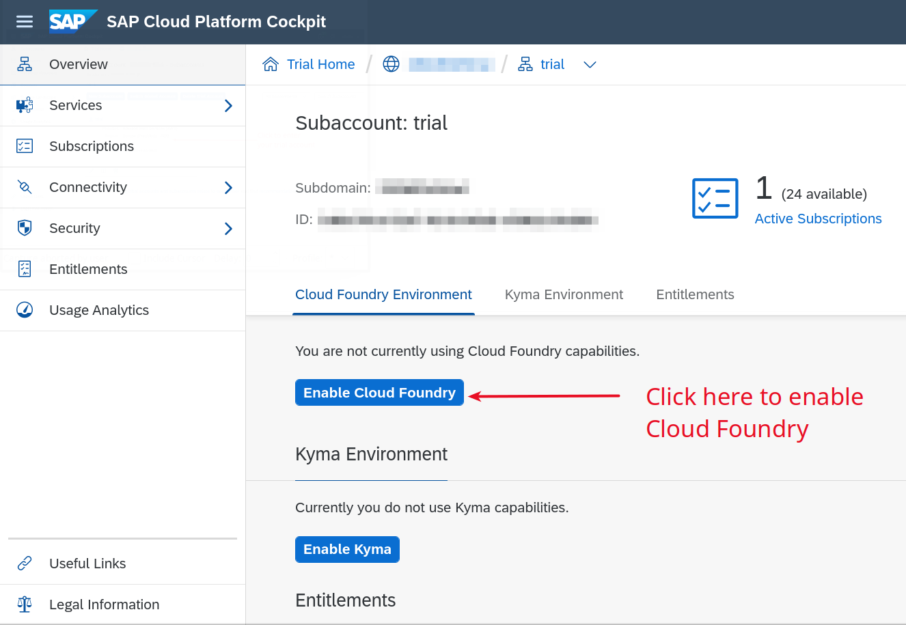
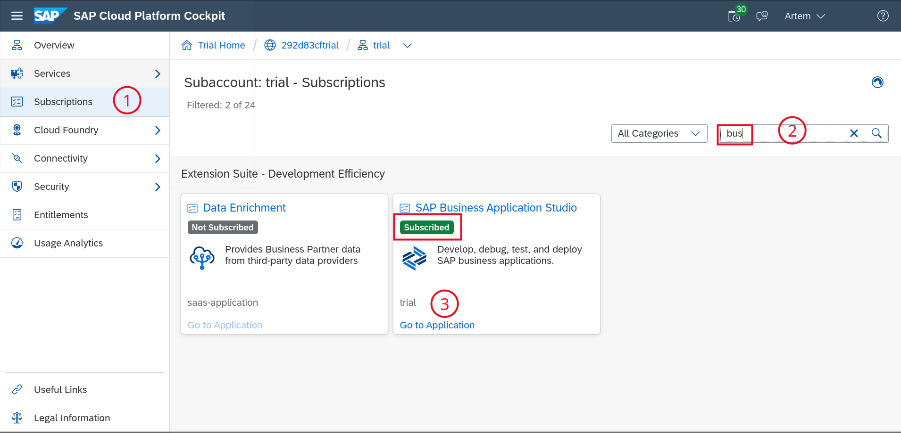

# DT261 - Extend SAP S/4HANA to meet unique business needs – the cloud-native way!

## Description

This repository contains the material for the SAP TechEd 2020 session called DT261 - Extend SAP S/4HANA to meet unique business needs – the cloud-native way!

## Overview

Address your custom requirements in the cloud with side-by-side extensions. Leverage the latest cloud-native technology to communicate with SAP S/4HANA and other SAP systems. Learn how you can use the embedded support in SAP Cloud SDK to quickly launch an online, cloud-native application built on state-of-the-art technology that integrates with SAP S/4HANA Cloud.

## Requirements

You will need the following to execute our exercises.

1. Trial account on SAP Cloud Platform with access to the following services
    - [Cloud Foundry](https://account.hana.ondemand.com/)
    - SAP Business Application Studio

1. A current version of Google Chrome

### Prepare upfront
- [Registering your trial account](https://www.youtube.com/watch?v=n5luSQKYvQQ) on SAP Cloud Platform and [Log In](https://account.hanatrial.ondemand.com/) to your cockpit.

- The Cloud Foundry environment should be enabled by default.

- If it's not [Enable Cloud Foundry](https://help.sap.com/viewer/a96b1df8525f41f79484717368e30626/Cloud/en-US/dc18bac42270468d84b6c030a668e003.html)

- By default you should be already subscribed to SAP Business Application Studio.
  

Follow [this tutorial](https://developers.sap.com/tutorials/appstudio-onboarding.html) if SAP Business Application Studio is not enabled. Make sure you reach the last step and see the `Dev Spaces` screen.

## Exercises

- [Getting Started - Deploying the Web Shop](exercises/ex0/)
    - Set up your IDE
    - Run the web shop in your IDE
    - Deploy the web shop to SAP Cloud Platform
- [Exercise 1 - Loading products from SAP S/4HANA Cloud](exercises/ex1/)
    - Implement the products controller
    - Configure the SAP S/4HANA destination in your IDE
    - Configure the SAP S/4HANA destination on SAP Cloud Platform
- [Exercise 2 - Placing the order with SAP S/4HANA Cloud](exercises/ex2/)
    - Implement the orders controller
    - Reuse the destination configurations from exercise 1
- [Exercise 3 - Loading promotions from SAP Promotion Pricing](exercises/ex3/)
    - Generate the client library
    - Implement the promotions controller
    - Configure the SAP Promotion Pricing destination in your IDE
    - Configure the SAP Promotion Pricing destination on SAP Cloud Platform

## How to obtain support

Support for the content in this repository is available during the actual time of the online session for which this content has been designed. Otherwise, you may request support via the [Issues](../../issues) tab.

## License
Copyright (c) 2020 SAP SE or an SAP affiliate company. All rights reserved. This file is licensed under the Apache Software License, version 2.0 except as noted otherwise in the [LICENSE](LICENSES/Apache-2.0.txt) file.
